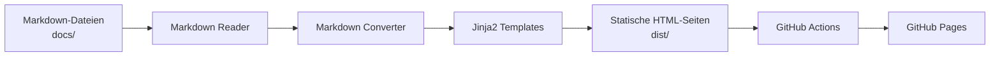

# Markdown2HTML – Automatischer Markdown → HTML Dokumentationsgenerator

## Projektbeschreibung

Markdown2HTML ist ein leichtgewichtiges Tool zur automatischen Konvertierung von Markdown-Dateien in eine statische HTML-Dokumentation.  
Das Projekt richtet sich insbesondere an Nutzer:innen ohne tiefgehende Programmierkenntnisse, die ihre Dokumentation einfach pflegen und automatisch online bereitstellen möchten.

Markdown-Dateien werden in einem definierten Ordner abgelegt, automatisch verarbeitet und über GitHub Pages als vollständige Website veröffentlicht – ohne manuelle Build- oder Deployment-Schritte.

---

## Zielgruppe

- Studierende
- Technische Redakteur:innen
- Projektteams mit Markdown-Dokumentation
- Nutzer:innen ohne Python- oder DevOps-Kenntnisse

---

## Funktionsumfang

- Automatische Konvertierung von Markdown zu HTML
- Einheitliches Layout über Jinja2-Templates
- Globale Stylesheets für konsistentes Design
- Automatisch generierte Navigation
- Ausgabe als statische Website
- Vollautomatisches Deployment über GitHub Actions
- Veröffentlichung über GitHub Pages

---

## Projektstruktur

```text
.
├─ docs/                # Markdown-Dateien (Input)
├─ src/                 # Python-Quellcode
│  ├─ main.py
│  ├─ markdown_converter.py
│  └─ reader/
├─ templates/           # HTML-Templates (Jinja2)
├─ assets/              # CSS / statische Assets
├─ dist/                # Generierte HTML-Seiten (Output)
├─ .github/workflows/   # GitHub Actions Workflow
├─ requirements.txt
└─ README.md
```

## Nutzung

1. Repository verwenden
   - Repository forken oder klonen

2. Markdown-Dateien erstellen
   - Eigene .md Dateien im Ordner docs/ anlegen oder bearbeiten

3. Änderungen pushen
```bash    
git add docs/
git commit -m "Update documentation"
git push
   ```

4. Ergebnis ansehen
   - GitHub Actions startet automatisch den Build- und Deployment-Prozess
   - Die generierte Dokumentation ist nach kurzer Zeit über GitHub Pages erreichbar

## Automatisches Deployment

Das Projekt nutzt GitHub Actions für den Build- und Deployment-Prozess:
* Bei jedem Push auf den main-Branch wird:
  - Python automatisch bereitgestellt
  - der Konverter ausgeführt
  - der Ordner dist/ erzeugt
  - die Website auf GitHub Pages veröffentlicht

Es ist keine lokale Installation von Python oder Abhängigkeiten notwendig.

## Architekturübersicht



## Abhängigkeiten

Die benötigten Python-Bibliotheken sind in der Datei `requirements.txt` definiert:
- `markdown` – Konvertierung von Markdown zu HTML
- `jinja2` – Template-Engine für HTML-Layouts

Diese Abhängigkeiten werden automatisch in GitHub Actions installiert.

## Lizenz / Hinweise

Dieses Projekt wurde im Rahmen einer Semesterarbeit entwickelt und dient primär zu Lern- und Demonstrationszwecken.
Eine produktive Nutzung ist möglich, jedoch ohne Gewähr.

## Autor

Lukas Sägesser  
Semesterarbeit – 2. Semester